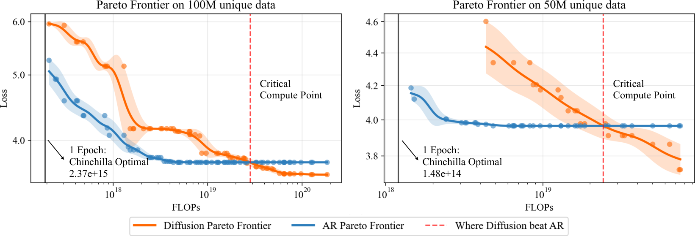
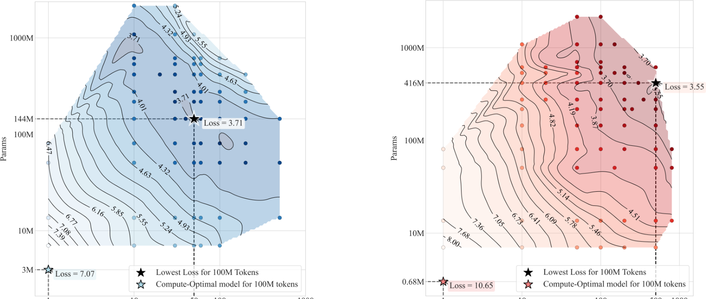
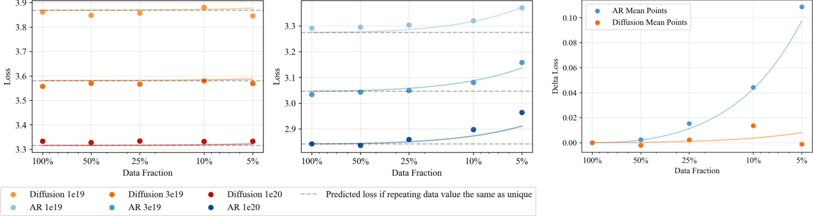
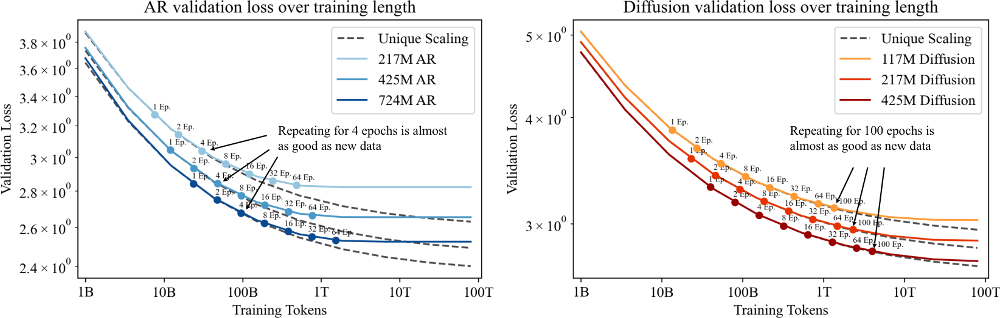
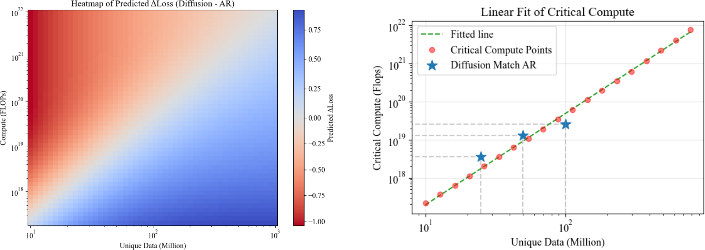
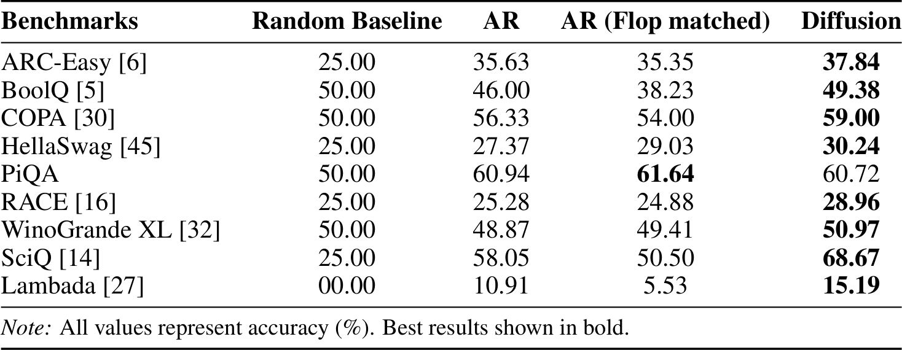
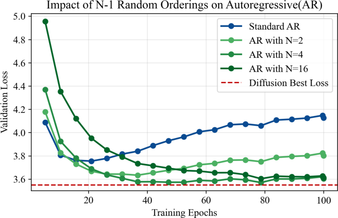

- 文章链接：https://openreview.net/forum?id=W5Ht05jF4c
- 作者：Mihir Prabhudesai, Mengning Wu, Amir Zadeh, Katerina Fragkiadaki, Deepak Pathak
- 机构：Carnegie Mellon University, Lambda
- 代码：https://github.com/wmn-231314/diffusion-data-constraint
- 项目页：https://diffusion-scaling.github.io/
- OpenReview：https://openreview.net/forum?id=W5Ht05jF4c
- 发表：NeurIPS 2025 Poster。本文使用 OpenReview / NeurIPS camera-ready PDF；arXiv 最新公开版本为 v7，提交日期为 2025-10-26。
- 领域：Diffusion language model、autoregressive language model、data-constrained scaling law、语言模型预训练
- 一句话总结：当唯一训练数据有限但 compute 还能继续投入时，masked diffusion language model 比 autoregressive model 更能利用重复数据；超过临界计算量后，diffusion 会在验证损失和多数下游任务上反超 AR。
-------
- 摘要：自回归（AR）模型长期主导着大语言模型领域，并推动了广泛任务上的进展。最近，基于扩散的语言模型作为一种有前景的替代方案出现，但它们相对于 AR 模型的优势仍未被充分研究。本文系统研究了数据受限场景下的 masked diffusion models；在这类场景中，训练需要对有限数据进行重复多轮使用。我们发现，当 compute 充足但数据稀缺时，它们显著优于 AR 模型。Diffusion 模型能更好地利用重复数据，取得更低的验证损失和更好的下游性能。我们为 diffusion 模型发现了新的 scaling laws，并推导出一个闭式表达式，用于刻画 diffusion 开始超过 AR 的临界 compute 阈值。最后，我们解释了 diffusion 模型为何在这一场景中表现突出：其随机 masking 目标会隐式地在丰富的 token ordering 分布上训练，起到一种隐式数据增强作用，而 AR 固定的从左到右分解不具备这一点。我们的结果表明，当瓶颈是数据而不是 compute 时，diffusion 模型为标准 AR 范式提供了一个有吸引力的替代选择。

# 1. 背景

- 本文研究的问题是：**在高质量训练数据有限、但训练 compute 仍可继续增加时，语言模型应该继续使用标准 AR 训练，还是考虑 masked diffusion 训练？**
  - 标准 AR 模型把文本序列按固定从左到右顺序分解，每个 token 只看前缀。
  - Masked diffusion language model 随机遮住一部分 token，用未遮住的上下文预测被遮住的位置，训练时具有双向上下文。
  - 过去很多比较默认数据与 compute 同步增长，这会把“compute 效率”和“样本效率”混在一起。

- 这个问题之所以重要，是因为未来真正紧缺的可能不是算力，而是高质量数据。
  - 如果新数据持续增加，AR 的固定 next-token prediction 仍然很强。
  - 如果唯一数据量固定，继续训练意味着反复扫同一批样本；此时模型能否从“重复样本”里挖出新训练信号，就变成了关键。
  - 作者把这个场景称为 data-constrained setting。

- 本文的核心观察可以概括为：**AR 更擅长单次高效利用新数据，diffusion 更擅长多次利用旧数据**。

    

    1. 在 Chinchilla-optimal 附近，AR 的 Pareto frontier 更好，说明低 compute / 单 epoch 附近 AR 更有优势。
    2. 随着训练 FLOPs 继续增加，AR 很快进入饱和甚至过拟合区间。
    3. diffusion 虽然前期更慢，但在重复数据上还能继续下降，并最终越过 critical compute point。

# 2. 本文方法

## 2.1 对比对象：AR 与 masked diffusion 的训练目标

- AR 模型采用固定 left-to-right factorization。给定长度为 \(L\) 的序列 \(x_1,\dots,x_L\)，AR 学习的是：

    $$
    p_{\mathrm{AR}}(x_1,\dots,x_L)=\prod_{j=1}^{L}p(x_j\mid x_{<j})
    $$

    这意味着第 \(j\) 个 token 的预测只能依赖 \(x_{<j}\)，不能看未来 token。实现上就是 causal attention mask。

- Masked diffusion 模型把序列随机破坏后再恢复。训练时先采样 mask ratio \(r\sim U(0,1)\)，然后独立地以概率 \(r\) 把 token 替换成特殊的 \([\mathrm{MASK}]\)。设被遮住的位置集合为：

    $$
    M=\{i\in[1,L]:\tilde{x}_i=[\mathrm{MASK}]\}
    $$

    模型用双向上下文预测这些 masked positions：

    $$
    p_{\mathrm{Diffusion}}(x\mid \tilde{x})=\prod_{i\in M}p_{\theta}(x_i\mid \tilde{x})
    $$

- 训练损失写成：

    $$
    \mathcal{L}_{\mathrm{Diffusion}}
    =
    -\mathbb{E}_{r,\tilde{x}\sim q_r}
    \frac{1}{r}
    \sum_{i\in M}\log p_{\theta}(x_i\mid\tilde{x})
    $$

    其中 \(\frac{1}{r}\) 是对不同 mask ratio 的重加权。可以把这个目标理解为数据 log-likelihood 的 ELBO 风格上界。

## 2.2 关键差异：不是噪声，而是 token ordering 的多样性

- 两类模型真正的差异不只是“是否加 mask 噪声”，而是 **prediction order 是否固定**。
  - AR 永远按照 \(1\rightarrow2\rightarrow\cdots\rightarrow L\) 的顺序建模。
  - diffusion 每次随机采样 mask pattern，同一个序列会形成许多不同的条件预测任务。
  - 这相当于模型在训练中看到了更丰富的 token ordering 分布。

- 可以这样理解：同一条句子如果被重复训练 100 次，AR 看到的监督结构几乎一样；diffusion 每次可能遮住不同位置，因此每次学到的条件关系不同。

    > 这也是本文最重要的机制假设：masked diffusion 对重复数据更鲁棒，不是因为它“更复杂”，而是因为它把重复样本转成了更多条件预测任务。

## 2.3 数据受限缩放律：把 unique data 和 repeated data 分开建模

- 传统 scaling law 通常把训练 token 数 \(D\) 当作总数据量，但在 data-constrained setting 中，\(D\) 其实由两部分组成：

    $$
    D=U\cdot E
    $$

    其中 \(U\) 是 unique tokens，\(E\) 是 epoch 数。

- 作者沿用 Muennighoff 等人的思路，引入有效数据量 \(D'\)，表示重复数据的边际价值会递减。若重复数据的价值按指数衰减，可写成：

    $$
    D'=
    U+
    U\cdot R_D^{\star}
    \left(1-e^{-(E-1)/R_D^{\star}}\right)
    $$

    其中 \(R_D^{\star}\) 描述重复数据还能贡献多少有效信息。\(R_D^{\star}\) 越大，说明模型越能从重复数据中继续获益。

- 最终 loss 仍然采用 Chinchilla 风格，只是把数据量与参数量换成有效量：

    $$
    L(N,D)=\frac{A}{(N')^{\alpha}}+\frac{B}{(D')^{\beta}}+E_0
    $$

    这里 \(N'\) 和 \(D'\) 分别是有效参数量与有效数据量，\(A,B,\alpha,\beta,E_0,R_D^{\star}\) 等由实验拟合得到。

## 2.4 方法差异在实验中的表现

- Figure 2 是理解本文方法的关键图：它不是单纯报告一个结果，而是把 epoch、参数规模、validation loss 的关系画成 contour。

    

    1. 在 100M unique token 下，AR 的最好点出现在较早 epoch；继续训练时，低 loss 区域不再稳定扩展。
    2. diffusion 在单 epoch 计算最优点明显更差，loss 为 10.65，而 AR 为 7.07。
    3. 但长训练后，diffusion 达到 3.55，优于 AR 的 3.71。
    4. 这说明 diffusion 的优势不是短期 compute efficiency，而是 repeated-data efficiency。

- Figure 3 进一步说明这种差异来自重复数据价值衰减速度不同。

    

    1. AR 的 repeated data value 衰减更快，重复 epoch 的边际收益很快变小。
    2. diffusion 的衰减更慢，说明同一批数据被重复使用时仍能提供有效训练信号。
    3. 这和随机 mask 带来的多 token ordering 解释是一致的。

# 3. 实验

## 3.1 实验设定

- **数据集**：主实验使用 English C4 corpus，并用 GPT-2 BPE tokenizer 处理文本；序列长度统一为 2048。
- **数据受限规模**：作者主要考察 \(U\in\{25M,50M,100M\}\) unique tokens，并在附录中补充 500M unique tokens 设置。训练时通过增加 epoch 数反复使用同一批 unique data，总训练 token 数为 \(D=U\cdot E\)。
- **模型规模**：模型从 7M 到 2.5B 参数，采用 GPT-2 style Transformer backbone，并使用 RoPE。AR 和 diffusion 尽量共享架构与数据 pipeline。
- **对比模型**：
  - AR：标准 autoregressive model，使用 causal attention mask 和 next-token prediction。
  - Diffusion / MDM：masked diffusion model，随机 mask token，并用双向 attention 预测 masked positions。
  - flop-matched AR：在下游任务中加入的对照，使用与 diffusion 接近的训练 FLOPs，以排除“只是训练更多”的解释。
  - AR with \(N\) random orderings：用于机制分析的控制实验，让 AR 也看到多个 token ordering。
- **指标**：
  - 主指标是 validation loss / negative log-likelihood 相关指标。
  - scaling law 分析关注 validation loss 随 model size、unique data、epoch、FLOPs 的变化。
  - 下游任务使用 accuracy，覆盖 ARC-Easy、BoolQ、COPA、HellaSwag、PiQA、RACE、WinoGrande XL、SciQ、Lambada 等。
- **公平性控制**：作者保持 Transformer backbone、数据处理、优化器超参等尽量一致；并承认默认超参来自 AR 相关工作，可能略微有利于 AR。MDM 验证时需要 Monte Carlo estimation，官方评估设置使用 \(num\text{-}mc=32\)。
- **实验规模**：论文训练了约 200 个模型，其中 AR 和 diffusion 各约 100 个，覆盖不同 unique data、model size 和 epoch。

## 3.2 实验结果与分析

### 3.2.1 数据受限时 diffusion 何时超过 AR

- 实验设定：在 25M、50M、100M unique token 设置下，对不同规模 AR 和 diffusion 模型训练多轮 epoch，比较 validation loss 与训练 FLOPs 的 Pareto frontier。

    

- 主要现象是：**AR 在低 compute 或接近 Chinchilla-optimal 单 epoch 区间更强，但继续训练后较快饱和；diffusion 初期 compute 效率差，却能在重复数据上继续下降**。
- Figure 5 从 scaling law 角度解释了这个差异：对 AR 来说，重复数据接近“新数据”的有效区间大约只有 4 epoch；对 diffusion，则可以接近 100 epoch。
- 这说明 diffusion 的优势不是“任何预算下都更好”，而是出现在 data bottleneck 明显、compute 还能继续投入的区域。
- 这个实验回答的是模型范式选择问题：如果训练预算只够看一遍数据，AR 更合理；如果数据少但可以反复训练，diffusion 才开始显示优势。

### 3.2.2 临界 compute 曲线：unique data 越多，diffusion 越晚反超

- 实验设定：作者基于拟合出的 data-constrained scaling law，预测不同 unique data 规模和 compute 预算下 AR 与 diffusion 的 loss gap，并求 diffusion match / beat AR 的 critical compute。

    

- Figure 6 左侧 heatmap 表示 \(\Delta L=L_{\mathrm{Diffusion}}-L_{\mathrm{AR}}\)：红色区域代表 diffusion loss 更低，蓝色区域代表 AR 更好。
- 右侧 critical compute curve 显示，diffusion 反超 AR 所需 FLOPs 随 unique data 呈 power law 增长，指数约为 2.174。
- 直觉上，unique data 越多，AR 固定 left-to-right factorization 也有足够新数据可学，因此能撑得更久；unique data 越少，AR 更早耗尽数据价值，diffusion 更早反超。
- 这条曲线的价值在于把“什么时候用 diffusion”从口号变成了一个可估计的资源边界。

### 3.2.3 下游任务：validation loss 优势是否能转化为实际能力

- 实验设定：在 100M unique token 设置下，作者选择 validation loss 最好的 AR、validation loss 最好的 diffusion，以及 FLOPs 匹配的 overfitted AR，在多个下游 language tasks 上比较 accuracy。

    

- Table 2 显示，diffusion 在 ARC-Easy、BoolQ、COPA、HellaSwag、RACE、WinoGrande XL、SciQ、Lambada 等多数任务上取得最好结果。
- PiQA 是一个例外，flop-matched AR 略优于 diffusion，这说明 diffusion 并不是所有任务上无条件占优。
- 这个实验很关键，因为它缓解了一个质疑：diffusion 的 validation loss 更低是否只是 loss 定义或估计方式带来的表象？下游任务结果至少说明，这种优势有相当一部分能转化为可观测任务表现。
- 不过，Table 2 仍然是在相对小规模数据和模型上做的，是否能外推到工业级预训练规模，论文没有完全解决。

### 3.2.4 机制分析：随机 token ordering 是 diffusion 样本效率的关键来源

- 实验设定：作者构造 AR with \(N\) random orderings，让 AR 训练时不再只使用固定 left-to-right 顺序，而是显式加入多个 token ordering，并观察 validation loss 是否接近 diffusion。

    

- Figure 7 是我觉得最有解释力的实验：当 ordering 数量从 2、4 增加到 16 时，AR 的 validation loss 明显改善，并逐步接近 diffusion 的最好结果。
- 这说明 diffusion 的优势很可能不是来自普通 token masking 或 dropout，而是来自**随机条件分解顺序**。
- 换句话说，diffusion 每次 mask 的位置不同，同一条序列会被转化成多个“根据不同上下文预测不同 token”的任务；AR 固定 left-to-right 时，这种数据增强不存在。
- 这也给后续研究留下了一个很直接的问题：能否把多 ordering 的收益引入 AR，同时保留 AR 的训练和推理效率？

# 4. 代码分析

官方代码基于 Megatron-DeepSpeed，仓库提供训练、验证、下游评测脚本和 Hugging Face 数据 / checkpoint 链接。它更像论文复现实验框架，而不是轻量 demo；README 中 quickstart 也以 8 张 H100 为参考。

核心实现位于 `pretrain_diff_gpt.py`。AR 使用 `pretrain_gpt.py`，MDM 使用 `pretrain_diff_gpt.py`，训练文档中尽量保持模型参数、optimizer、DeepSpeed 配置和数据路径一致，避免非目标变量影响比较。

## 4.1 伪代码

下面的伪代码根据官方 `pretrain_diff_gpt.py` 抽象而来：

```python
def build_diffusion_batch(raw_tokens):
    # 去掉最后一个 token，保证输入和监督标签在长度上对齐。
    tokens = raw_tokens[:, :-1]
    labels = tokens

    # 每个样本独立采样噪声强度，让一个 batch 同时覆盖易/难去噪任务。
    t = uniform(0, 1, shape=[batch_size])
    p_mask = (1 - eps) * t + eps
    p_mask = repeat_to_sequence_length(p_mask)

    # 随机遮蔽 token；被遮蔽的位置才是 diffusion 训练真正要预测的位置。
    masked = uniform(0, 1, shape=tokens.shape) < p_mask
    noisy_input = where(masked, MASK_TOKEN_ID, tokens)

    # diffusion 使用双向上下文，所以 attention mask 不再是 AR 的 causal mask。
    attention_mask = all_visible_attention_mask(seq_len)
    position_ids = build_position_ids(tokens)
    return noisy_input, labels, attention_mask, position_ids, masked, p_mask


def diffusion_loss(model, batch):
    # 模型看到 noisy input，目标是恢复原始 token。
    logits = model(batch.noisy_input, batch.position_ids, batch.attention_mask)
    token_losses = cross_entropy(logits, batch.labels)
    # 只统计 masked 位置，并用 1 / p_mask 做重加权，对应论文的 masked diffusion objective。
    losses = token_losses[batch.masked] / batch.p_mask[batch.masked]
    return losses.sum() / num_tokens
```

这个实现对应论文里的 masked diffusion objective：输入是随机遮蔽后的序列，预测目标是原 token，注意力是双向的，损失只对被 mask 的位置负责。

## 4.2 工程技巧

- **AR 和 diffusion 共用同一套分布式训练框架，只把目标差异集中到 batch 与 loss。** 这样做的好处是控制变量：模型 backbone、数据读取、DeepSpeed 并行和日志系统尽量一致，比较更干净。

    ```python
    # pretrain_diff_gpt.py
    tokens_ = data_b['text'].long()
    # diffusion 预测当前位置原 token，因此 label 和输入 token 对齐，而不是右移一位。
    tokens = tokens_[:, :-1].contiguous()
    ...
    noisy_input = torch.where(masked_indices, mask_token_id, tokens)
    labels = tokens
    ```

- **mask ratio 按样本采样，再扩展到 token 维度。** 这比全 batch 使用同一个 mask ratio 更灵活，同一个 batch 内会同时出现不同难度的 denoising 样本。

    ```python
    # pretrain_diff_gpt.py
    micro_batch_size, seq_length = tokens.size()
    # 每个样本单独采样 t，避免整个 batch 都处在同一噪声难度。
    t = torch.rand(micro_batch_size, device=tokens.device)

    # 训练早期可降低噪声，先让模型学习较容易的恢复任务。
    if args.low_noise_start and args.iteration < args.low_noise_iter:
        t = t * args.low_noise_ratio

    p_mask = (1 - eps) * t + eps
    p_mask = p_mask[:, None].repeat(1, seq_length)
    masked_indices = torch.rand((micro_batch_size, seq_length), device=tokens.device) < p_mask
    ```

- **全可见 attention mask 直接把 AR 的 causal restriction 去掉。** 代码里用全 1 张量再转成全 False mask，表示没有位置被屏蔽；这就是 bidirectional attention 的实现核心。

    ```python
    # pretrain_diff_gpt.py
    # 构造全可见 attention：diffusion 不需要像 AR 那样屏蔽未来 token。
    attention_mask = torch.ones(1, 1, seq_length, seq_length, device=tokens.device)
    attention_mask = (attention_mask < 0.5)  # 全 False 表示没有位置被 mask。
    ```

- **loss 只在 masked positions 上计算，并按 mask probability 重加权。** 这对应论文中的 \(\frac{1}{r}\) 项，使不同 mask ratio 的样本在估计目标时更一致。

    ```python
    # pretrain_diff_gpt.py
    def loss_func(loss_mask, moe_loss, mos_loss, masked_indices, p_mask, output_tensor):
        # 只取被 mask 的 token loss，并按 mask 概率重加权。
        losses = output_tensor[masked_indices].float() / p_mask[masked_indices].float()
        loss = losses.sum() / (output_tensor.shape[0] * output_tensor.shape[1])
        # 分布式训练下同步平均 loss，保证日志和反传尺度一致。
        averaged_loss = average_losses_across_data_parallel_group([loss])
        ...
        return loss, {'lm loss': averaged_loss[0]}
    ```

- **保留 AR-like masking 开关，方便做机制控制实验。** `ar_ratio` 让一部分样本从随机 mask 切换成右侧连续 mask，用于构造更接近 AR ordering 的训练条件。

    ```python
    # pretrain_diff_gpt.py
    if args.ar_ratio > 0:
        # 按样本决定是否切换成 AR-like masking，用于机制对照实验。
        ar_mask = torch.rand((micro_batch_size,), device=tokens.device) <= args.ar_ratio
        for i in range(micro_batch_size):
            if ar_mask[i]:
                num_masked = torch.sum(masked_indices[i, :])
                masked_indices[i, :] = False
                # 只遮蔽后缀，相当于把随机 ordering 改成更接近 AR 的固定顺序。
                masked_indices[i, -num_masked:] = True
    ```

# 5. 总结

这篇论文的核心价值不是证明“diffusion 全面击败 AR”，而是指出：**模型范式的优劣依赖资源约束条件**。当唯一数据充足、训练接近单 epoch 时，AR 仍然非常强；当数据成为瓶颈、compute 还能继续投入时，diffusion 的随机条件预测目标会更能利用重复数据。

## 5.1 创新思想来源

我理解这篇论文的创新来自三个方向的交叉：

- Chinchilla 和后续 data-constrained scaling law 关注 compute、参数量、数据量之间的关系。
- Masked diffusion language model 关注用随机 mask 和双向上下文替代固定 next-token prediction。
- 数据稀缺场景要求模型从重复样本中获得更多有效训练信号。

作者真正做的事情，是把 diffusion 的随机 mask 目标放到 data-constrained scaling law 里重新评估。于是一个过去看起来像缺点的属性，也就是“需要更多训练 compute”，在数据受限场景里变成了“能继续消化重复数据”的优势。

## 5.2 Review意见

OpenReview 最终决策是 Accept (poster)。评审整体认可论文问题重要、实验规模大、结论有启发性，尤其认可它指出了 masked diffusion model 在数据受限场景中可能优于 AR。

主要质疑包括：

- 技术新颖性更多来自系统实验和缩放律分析，而不是新模型或新算法。
- AR 的 exact NLL 与 diffusion 的 upper-bound / Monte Carlo loss 是否完全可比。
- C4 子集和当前模型规模是否足以支持向更大规模真实预训练外推。
- 是否需要更多数据集、更多模型结构和更多 human-judgment 任务来验证泛化性。

作者在 rebuttal 和 camera-ready 中补充了下游任务、500M unique token、学习率探索和 token ordering 控制实验。最终评审分数包括 5、5、4、4，说明论文仍有争议，但实验和问题设定足够有说服力。

## 5.3 未来展望

第一，能不能把 diffusion 的多 ordering 优势移植到 AR 中？Figure 7 已经说明随机 ordering 会改善 AR，但如何在不显著牺牲训练和推理效率的前提下实现，仍然是开放问题。

第二，临界 compute 曲线需要在更大模型、更大数据和更多数据域上验证。尤其是代码、多语言、专业领域文本中，重复数据价值的衰减规律可能不同。

第三，训练收益之外还要看推理成本。Diffusion 语言模型通常涉及迭代生成，如果部署成本过高，即使训练阶段更适合数据受限场景，也不一定在所有产品场景中划算。

## 5.4 Q&A

**Q1：这篇论文是在说 diffusion language model 全面优于 AR 吗？**

不是。论文结论有明确条件：数据受限、重复训练、多 epoch、compute 还能继续投入。在单 epoch 或低 compute 区间，AR 仍然更强。

**Q2：为什么 diffusion 更能利用重复数据？**

作者的解释是随机 mask 让同一条样本在不同 epoch 中变成不同的条件预测任务，相当于学习许多 token ordering。AR 固定从左到右，重复看同一数据时更容易耗尽有效信号。

**Q3：validation loss 的比较是否完全公平？**

这是评审也关注的问题。AR 的 NLL 更直接，diffusion loss 是估计式 / 上界式目标。论文用下游任务结果补强了结论，但 loss 可比性仍是阅读时要保留的 caveat。

**Q4：如果我想复现，应该从哪里开始？**

先跑官方 quickstart 的 evaluation，再选较小模型复现不同 epoch 下 AR 饱和、MDM 继续下降的趋势。完整 scaling law 拟合需要训练大量模型，成本较高，不适合作为第一步。
